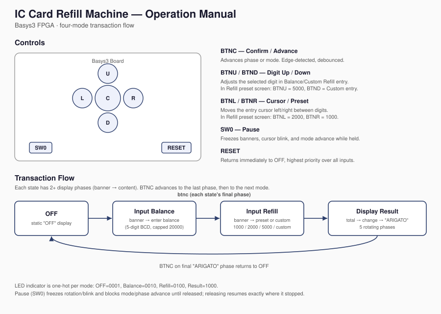
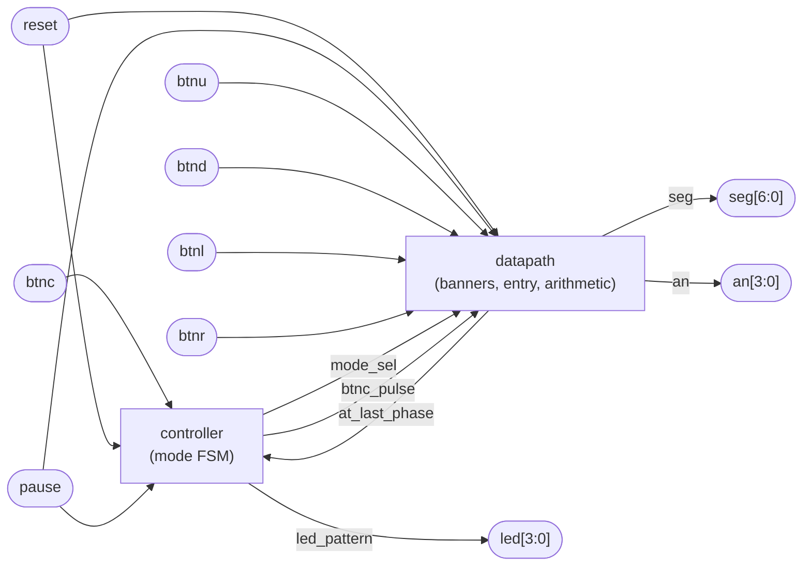
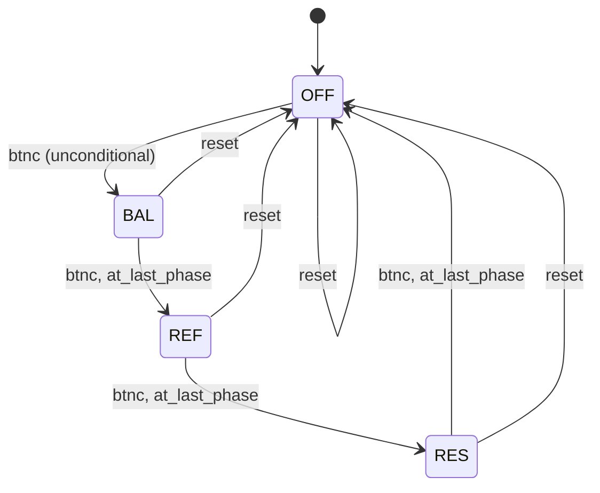
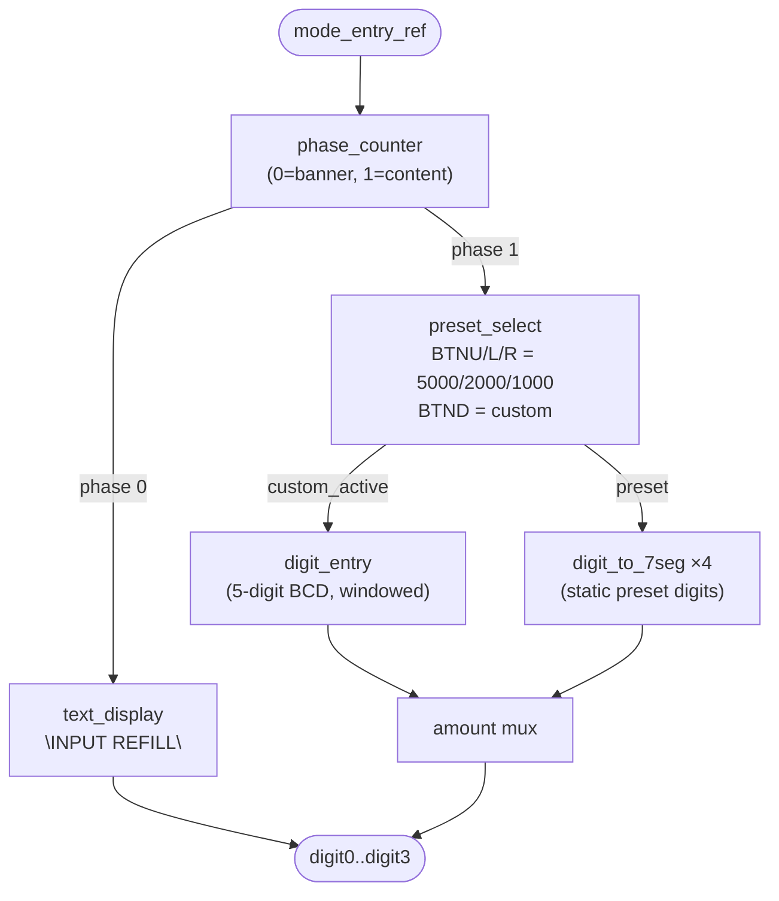

# IC Card Refill Machine — FPGA Top-Up Kiosk

A Verilog implementation of a Suica/Pasmo-style IC card top-up kiosk, built for the Digilent
Basys3 (Xilinx Artix-7, `xc7a35tcpg236-1`). Walks a user through entering their current card
balance, selecting a refill amount (preset or custom), and viewing the updated total and
change due — all on a 4-digit 7-segment display.

## Demo Behavior

The machine has four modes, cycled by `BTNC`:

| Mode | Display Content | LED Pattern |
|---|---|---|
| OFF | static `OFF` | `0001` |
| Input Balance | rotating "CURRENT BALANCE" banner → 5-digit BCD entry | `0010` |
| Input Refill | rotating "INPUT REFILL" banner → preset select or custom entry | `0100` |
| Display Result | "UPDATED TOTAL" → new total → "CHANGE" → change due → "ARIGATO" | `1000` |

- **Reset** returns immediately to OFF and takes priority over every other input.
- **Pause** (`SW0`) freezes banner rotation, cursor blink, and blocks mode/phase advance —
  releasing it resumes exactly where it stopped.
- Balance is capped at 20000; if a refill would push the total over the cap, the result
  screen shows the capped total and the change due back to the user.

See the full control layout and operation flow below.



## How to Run and Test on Board

Requires [Xilinx Vivado](https://www.xilinx.com/support/download.html) and a Digilent Basys3
board (part `xc7a35tcpg236-1`) connected via micro-USB.

1. **Clone the repo and open Vivado.**
   ```bash
   git clone <this-repo-url>
   ```
   Create a new RTL project targeting part `xc7a35tcpg236-1`.

2. **Add design sources.** Add every file under `rtl/` as a design source, and set
   `refill_top` as the top module.

3. **Add constraints.** Add your `.xdc` file from `constraints/` to the project as a
   constraints source — it should map `clk`, `reset`, `pause`, `btnc`, `btnu`, `btnd`,
   `btnl`, `btnr`, `led[3:0]`, `seg[6:0]`, and `an[3:0]` to the Basys3 pinout.

4. **Synthesize, implement, and generate the bitstream.** Run through Vivado's flow
   (Synthesis → Implementation → Generate Bitstream), checking the synthesis report for
   inferred-latch warnings before continuing.

5. **Program the board.** Open Hardware Manager, connect to the Basys3, and program the
   device with the generated bitstream.

6. **Test on hardware.** Walk through this checklist:
   - Power on (or press reset): LEDs show `0001`, display shows `OFF`.
   - Press `BTNC`: LEDs → `0010`, "CURRENT BALANCE" banner starts rotating.
   - Press `BTNC` again: enters balance entry. Use `BTNL`/`BTNR` to move the cursor,
     `BTNU`/`BTND` to adjust the selected digit (0–9, wrapping). Cursor blinks on the
     hundred-thousands digit is not possible — the top digit is capped 0–2, and hitting 2
     locks the lower four digits at 0 (the 20000 ceiling).
   - Press `BTNC`: LEDs → `0100`, "INPUT REFILL" banner starts rotating.
   - Press `BTNC` again: enters preset/custom selection. `BTNU` = 5000, `BTNL` = 2000,
     `BTNR` = 1000, `BTND` = switch to custom entry (same digit-entry controls as balance).
   - Press `BTNC`: LEDs → `1000`, result screen rotates through UPDATED TOTAL → total value
     → CHANGE → change value → ARIGATO.
   - Press `BTNC` on the ARIGATO phase: returns to OFF (`0001`), ready for the next
     transaction.
   - At any point, flip `SW0` up: rotation, blink, and mode/phase advance all freeze. Flip
     it back down: everything resumes from exactly where it stopped.
   - Press reset at any point: immediately returns to OFF, regardless of mode or pause state.

## Architecture

The design follows a datapath/controller split: `controller` is a small FSM that only tracks
*which mode* the machine is in, while `datapath` owns everything else — banners, digit entry,
arithmetic, and display output.



`mode_sel` tells the datapath which of the four mode blocks is active; `at_last_phase` feeds
back from whichever block is enabled so the controller knows when it's safe to advance to the
next mode.

### Mode FSM



OFF is a special case: it has no phase counter of its own, so it advances on `btnc_pulse`
alone rather than waiting on `at_last_phase` (which is hardwired low for OFF).

### Inside a mode block (Input Refill example)

Each non-OFF mode is a two-phase block: a rotating banner, then content. Input Refill's
content phase additionally branches between a static preset display and live digit entry:



## Module Overview

| File | Description |
|---|---|
| `refill_top.v` | Top-level module. Wires `controller` and `datapath` together; no behavioral logic. |
| `controller.v` | Mode FSM (OFF/Balance/Refill/Result). Debounces `btnc`, gates mode advance by pause/`at_last_phase`, drives `led_pattern`. |
| `mode_decoder.v` | Decodes `mode_sel` into one-hot `enable_*` signals for each mode block. |
| `datapath.v` | Wraps every mode block, the clock dividers, button debouncers, output muxes, and the display multiplexer. |
| `phase_counter.v` | Generic sub-state counter used by every mode block to track banner-vs-content (or, for Result, which of 5 rotating phases is active). |
| `phase_done_mux.v` | Selects the active mode block's `phase_done` signal and forwards it to the controller as `at_last_phase`. |
| `balance_block.v` | Input Balance mode: banner + `digit_entry` for the 5-digit balance. |
| `refill_block.v` | Input Refill mode: banner + preset selection or custom `digit_entry`. |
| `result_block.v` | Display Result mode: runs the BCD arithmetic chain and rotates through 5 display phases (total/change/thank-you). |
| `digit_entry.v` | 5-digit BCD entry with a 4-digit visible scrolling window, blinking cursor, and a 20000 balance ceiling that locks the lower digits at 0. |
| `preset_select.v` | Latches one of three fixed refill presets or hands off to custom entry, gated by the active mode so button presses in other modes don't leak in. |
| `text_display.v` | Fixed-message rotating banner (parameterized by message string and length). |
| `number_display.v` | Same rotation behavior as `text_display`, but scrolls a live BCD value converted to ASCII. |
| `off_display.v` | Static "OFF" display, hardcoded 7-segment patterns (no rotation). |
| `digit_output_mux.v` | Selects which mode block's 4 digits actually drive the display. |
| `bcd_adder.v` / `bcd_subtractor.v` | BCD arithmetic (with correction) for computing the new total and change due. |
| `cap_compare.v` | Detects whether balance + refill exceeds the 20000 cap. |
| `bcd_to_ascii.v` | Converts a 5-digit BCD value to ASCII for display via `letter_to_7seg`. |
| `letter_to_7seg.v` | ASCII-to-7-segment decoder (active-low), covering digits and every letter used in the project's banners. |
| `digit_to_7seg.v` | BCD-digit-to-7-segment decoder (0–9, blanks on out-of-range input) used for live digit entry and static preset display. |
| `button_pulse.v` | Wraps `rising_edge_detector` with a second edge detector to produce a clean single-cycle pulse — needed because a raw debounced edge stays high for roughly half a debounce period, not one clock cycle. |
| `rising_edge_detector.v` | Debounced level-to-pulse detector, parameterized by debounce width. |
| `time_mux_state_machine.v` | Cycles the four digit anodes so all four digits appear lit simultaneously. |
| `clkdiv.v` | Parameterized clock divider — instantiated for the ~3 Hz rotation/blink tick and the ~763 Hz display refresh. |

## Hardware Notes / Bring-Up

A few non-obvious decisions came out of actual hardware bring-up, not just the paper design:

- **Debounce width matters more than it looks.** The reused `rising_edge_detector`'s default
  debounce (2²⁷ cycles, ~1.3 s) is far too slow for a real button; every instance here
  overrides it (2¹⁷–2²⁰ cycles). `button_pulse` further wraps the debounced edge in a second
  edge detector — without it, a single physical press was observed to cascade through
  multiple mode transitions in one held window (OFF → Balance → Refill from one press).
- **Digit mirroring fix.** The display multiplexer's `in0`/`in3` connections are deliberately
  reversed from a naive wiring, because `an[0]` is the Basys3's physical *rightmost* digit
  while every block in this design defines `digit0` as the *leftmost* character. Without the
  swap, "OFF" displayed mirrored as "FFO".
- **Display multiplexer reset is independent of the system reset.** `time_mux_state_machine`
  is driven by a one-shot power-on reset, not the board's `reset` switch. Since `reset` here
  is a level-held switch (not a momentary pulse), tying it directly to the multiplexer would
  pin the display at digit slot 0 for as long as reset is held, showing only one lit digit.
- **`preset_select` is enable-gated.** Early on, the preset-selection logic reacted to
  `BTNU`/`BTND`/`BTNL`/`BTNR` even while the machine was in Balance or Result mode, since
  those are the same raw button signals shared globally in the datapath — silently changing
  the computed refill total. Gating it with `enable_ref` fixed it.
